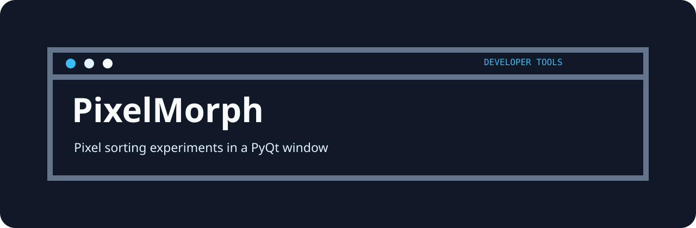
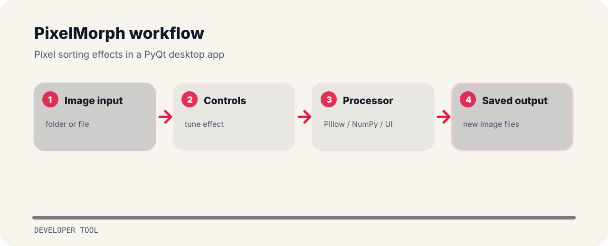

# PixelMorph



Pixel sorting effects in a PyQt desktop app.

## Flow



## Run it locally

```bash
git clone https://github.com/mertefekurt/pixelmorph.git
cd pixelmorph
python -m pip install -r requirements.txt
python main.py
```

## Useful edges

- Designed as a focused developer tool repo.
- Keeps setup short.
- Prioritizes readable output over infrastructure.

## File path

```text
animations.py       project file
image_loader.py     project file
image_processor.py  project file
image_saver.py      project file
main.py             application entry
```
