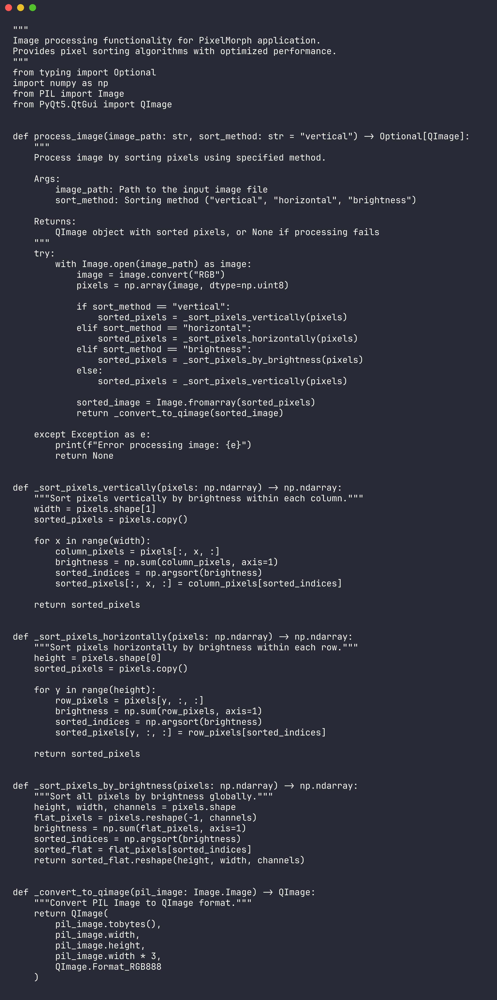

# PixelMorph

<div align="center">


</div>

PixelMorph is a desktop image-processing app for creating pixel-sorted glitch-style visuals. It loads an image, applies vertical, horizontal, or global brightness sorting, previews the result, and saves the processed output.



## Features

- PyQt5 desktop interface
- Image loading and preview workflow
- Vertical pixel sorting by column brightness
- Horizontal pixel sorting by row brightness
- Global brightness-based pixel sorting
- Pillow and NumPy processing pipeline
- Save/export support for processed images

## Quick Start

```bash
git clone https://github.com/mertefekurt/pixelmorph.git
cd pixelmorph
python -m venv .venv
source .venv/bin/activate
pip install -r requirements.txt
python main.py
```

## Project Structure

```text
main.py             Application entry point
ui_elements.py      PyQt5 window and controls
image_loader.py     Image selection/loading helpers
image_processor.py  Pixel sorting algorithms
image_saver.py      Export helpers
animations.py       UI animation support
requirements.txt    Runtime dependencies
```

## Sorting Modes

| Mode | Behavior |
| --- | --- |
| `vertical` | Sorts each image column by brightness |
| `horizontal` | Sorts each image row by brightness |
| `brightness` | Sorts all pixels globally by brightness |
